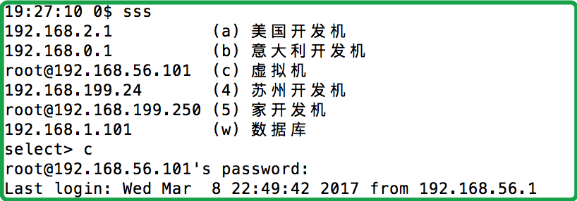

# sss
terminal ssh manager

## install

~~~bash
chmod +x sss
mv sss ~/Programs
export PATH=~/Programs:$PATH
sss
~~~

福利来啦，送给大家一个 terminal ssh manager

在 terminal 下使用 ssh，你再也不用设置 alias 了。

直接写一个叫 sss 的配置文件，然后执行它就可以了 — 它既是配置文件，也是可执行文件。

喏：
就是这个 sss 文件，只有20行的源代码。

